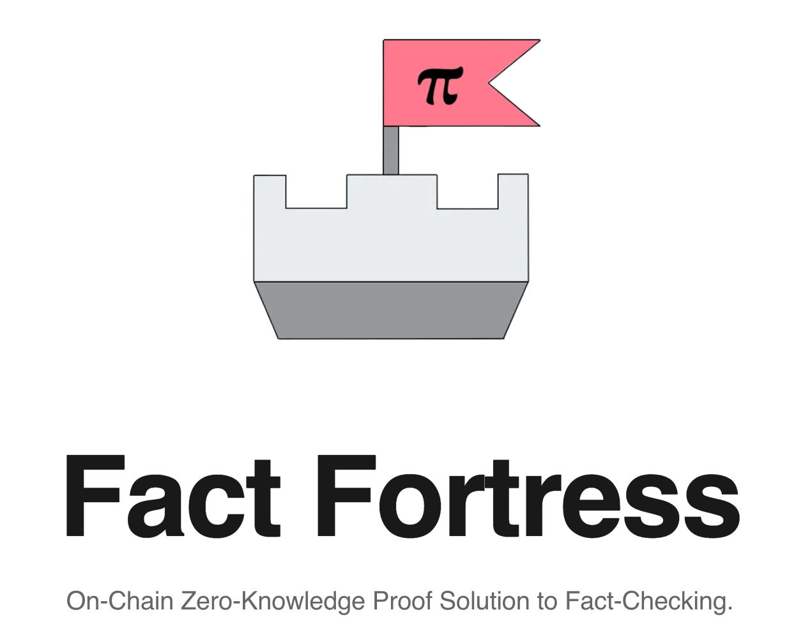
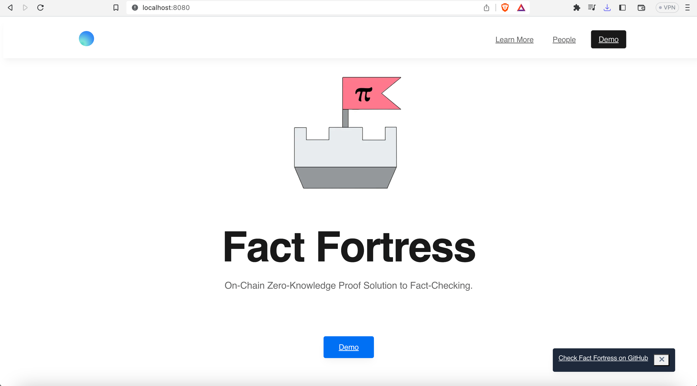

# Fact Fortress Dapp



Fact Fortress is a blockchain-integrated solution that democratizes the use of zero-knowledge proofs to ensure the integrity of private data. **It provides a user-friendly interface for generating proofs off-chain through a circuit generator that leverages the Noir language, and facilitates on-chain verification of the proofs on Ethereum.**
 
By enabling the validation of data integrity without revealing the data itself, our solution offers a powerful mechanism for preserving the privacy of sensitive information while ensuring the security and transparency of blockchain technology.


## Prerequisites

- NodeJS 18
- pnpm [https://pnpm.io/fr/installation](https://pnpm.io/fr/installation)

Install the backend and the frontend:

```
git clone git@github.com:pierg/fact-fortress-dapp.git
cd fact-fortress-dapp && pnpm install
git clone git@github.com:pierg/fact-fortress-frontend.git
cd fact-fortress-frontend && pnpm install
```

## Run the back-end

From the root directory, run:

```
pnpm backend
```

(By default, the backend runs on port `3000`).

A Postman collection is provided to interact with the backend: `tools/Postman_collection/ZKP_Health.json`

## Run the front-end



*Once the backend is running* (`► server started on port 3000 ✓`), from the root directory run:

```
pnpm frontend
```

Then, open `http://localhost:8080` on your browser.

(By default, the backend runs on port `8080`).

## Run the unit tests


From the root directory, run:

```
pnpm run test
```

These tests notably contain an end-to-end flow, from the authorization of authorities to the on-chain verification of the proof of Schnorr signature.

## Backend End-to-End Flow

### 1 | Generate the public/private keys pair

*Hospitals generate a private/public key pair based on the Grumpkin elliptic curve, used by Noir.*

| WARNING: This action should be performed offline. This endpoint is just an helper. Hospitals are expected to generate the keys themselves. |
| ------------------------------------------------------------------------------------------------------------------------------------------ |

```
GET http://localhost:3000/key_pair
```

* **Input**
    * (None)
* **Output**
    * `public_key` Public key based on the Grumpkin curve, used by Noir
    * `private_key` Random private key

https://user-images.githubusercontent.com/66550865/232197455-d07dbda7-45aa-470e-86fa-e5cfa62a14a6.mov


*Example*

```
curl --location 'http://localhost:3000/key_pair'
{
    "public_key": "0x0dd7811f6af9d473c41376affb8660aba00e255c49844b31182f54bc0ab3e2ae1b23bd0e9afdb8275f880934b115057ed86f075048d4d8bd9fa8d92670dc6892",
    "private_key": "ca1a2b52a7405f06f71c03cbaada78559aa86a0e2d01321540012f3762a12818"
}
```

- - -

### 2 | Authorize the hospital to upload its public key *(On-Chain)*

*Hospitals have to be authorized to upload their public keys on the blockchain (otherwise anyone could do it). To do so, a NFT-based mechanism is used. The owner of the NFT smart contract has to autorize hospitals once by sending them NFTs for this purpose.*

```
GET http://localhost:3000/mint
```

* **Caller**
    * Owner of the contract
* **Input**
    * (Header) `from: owner` Only the owner of the contract can mint
    * (Parameter) `recipient` Address of the hospital about to receive the NFT
* **Output**
    * `recipient` Address of the hospital having received the NFT
    * `token_id` NFT token ID

https://user-images.githubusercontent.com/66550865/232197466-fc5ce95b-7f7b-4915-b0f3-3c334716a538.mov


*Example*

```
curl --location 'http://localhost:3000/mint?recipient=0x98526c571e324028250B0f5f247Ca4F1b575fadB' \
--header 'from: owner'
{
    "recipient": "0x98526c571e324028250B0f5f247Ca4F1b575fadB",
    "token_id": "1"
}
```

- - -

### 3 | Upload the public key *(On-Chain)*

*Hospitals upload their public key (for the first time or when they generate a new one). This process enables the verification of the public inputs in the context of the proof of provenance.*

```
PUT http://localhost:3000/publickey
```

* **Caller**
    * Hospital
* **Input**
    * (Header) `from: owner` Only the hospital owner of an NFT can upload its public key
    * (Parameter) `name` Name associated with the public key
    * (Parameter) `public_key` Grumpkin-based public key
* **Output**
    * `name` Name associated with the public key
    * `public_key` Grumpkin-based public key
    * `public_key_version` Version of the public key


https://user-images.githubusercontent.com/66550865/232227093-1b747ec1-f287-450d-b50a-a4c6d20ee952.mov


*Example*

```
curl --location --request PUT 'http://localhost:3000/publickey?name=hospitaA&public_key=0x0dd7811f6af9d473c41376affb8660aba00e255c49844b31182f54bc0ab3e2ae1b23bd0e9afdb8275f880934b115057ed86f075048d4d8bd9fa8d92670dc6892' \
--header 'from: hospitalA'
{
    "name": "hospitaA",
    "public_key": "0x0dd7811f6af9d473c41376affb8660aba00e255c49844b31182f54bc0ab3e2ae1b23bd0e9afdb8275f880934b115057ed86f075048d4d8bd9fa8d92670dc6892",
    "public_key_version": "0"
}
```

- - -

### 3b (optional) | Get the public key *(On-Chain)*

*Using this endpoint, anyone (including the verifiers) can get the public keys of hospitals.*

```
GET http://localhost:3000/publickey
```

* **Caller**
    * Anyone
* **Input**
    * (Parameter) `name` Name associated with the public key
    * (Parameter) `version` Version of the public key
* **Output**
    * `public_key` Grumpkin-based public key


https://user-images.githubusercontent.com/66550865/232227105-e7224e43-92b5-4dbc-ad4a-a8edcb2745cf.mov


*Example*

```
curl --location 'http://localhost:3000/publickey?name=hospitalA&version=0'
{
    "public_key": "0x0dd7811f6af9d473c41376affb8660aba00e255c49844b31182f54bc0ab3e2ae1b23bd0e9afdb8275f880934b115057ed86f075048d4d8bd9fa8d92670dc6892"
}
```

- - -

### 4 | Hash and Sign Health Data

*Hospitals have to (SHA-256) hash and sign (using the Grumpkin elliptic curve) the health data.*

| WARNING: This action should be performed offline. This endpoint is just an helper. Hospitals are expected to hash and sign the health data themselves. |
| ------------------------------------------------------------------------------------------------------------------------------------------------------ |

```
POST http://localhost:3000/sign
```

* **Input**
    * (Body) `private_key` Private key associated with the public key that will be used for the proof
    * (Body) `message` Health data to hash and sign
* **Output**
    * `hash` SHA-256 hash of the data (hex)
    * `signature` Signature of the hash (bytes)


https://user-images.githubusercontent.com/66550865/232200525-d5610ff1-f8b9-4973-b1d5-5a7c43e00dbe.mov

*Example*

```
curl --location 'http://localhost:3000/sign' \
--header 'Content-Type: application/json' \
--data '{
	"private_key": "ca1a2b52a7405f06f71c03cbaada78559aa86a0e2d01321540012f3762a12818",
	"message": {
        "patient_id_0": {
            "genetic_data": {
                "rs10757274": "AA",
                "rs562556": "AA",
                "rs429358": "TT",
                "rs7412": "TT",
                "rs1801133": "TT"
            },
            "name": "Charlie"
        },
        "patient_id_1": {
            "genetic_data": {
                "rs10757274": "GG",
                "rs562556": "AG",
                "rs429358": "TT",
                "rs7412": "CT",
                "rs1801133": "TT"
            },
            "name": "Alice"
        }
	}
}'
{
    "hash": "e51b88c9ef2ee7a084f676a4d07313895e2850f6789e1bb1aa9845c3d2dd6dea",
    "signature": [
        30,
        149,
        144,
        . . .
        10,
        179,
        103
    ]
}
```

- - -

### 5 | Store the signature *(On-Chain)*

*Hospitals store the signature on the blockchain. That enables the verification of the proof of provenance.*

```
GET http://localhost:3000/signature
```

* **Caller**
    * Hospital
* **Input**
    * (Parameter) `public_key` Grumpkin-based public key
    * `signature` Signature of the hash (bytes)
* **Output**
    * `stored` Status: `true` if the signature has been stored, `false` otherwise


https://user-images.githubusercontent.com/66550865/232287544-1b4dcc01-1fde-41b2-8f1e-3f36bc10a1cc.mov

*Example*

```
curl --location 'http://localhost:3000/signature?public_key=0x077418dea85cb9695990062d64d4d4add4a4d8cbbed3a5f9e5d5f299766bcdf22a10a3540173df59a3e03533011d867c7a8d879dc3819c8c4857ef3a04a6b103' \
--header 'from: HospitalA' \
--header 'Content-Type: application/json' \
--data '{
    "hash": "e51b88c9ef2ee7a084f676a4d07313895e2850f6789e1bb1aa9845c3d2dd6dea",
    "signature": [
        30,
        149,
        144,
        . . .
        10,
        179,
        103
    ]
}'
{
    "stored": true
}
```

- - -

### 6 | Generate the Proof

*Researchers generate the proof (should be done online).*

| WARNING: This action should be performed offline. This endpoint is just an helper. Researchers are expected to generate the proofs themselves. |
| ---------------------------------------------------------------------------------------------------------------------------------------------- |

```
POST http://localhost:3000/generate_proof
```

* **Input**
    * (Parameter) `public_key` Grumpkin-based public key
    * (Body) `hash` Health data hash (hex; copied from step 4)
    * (Body) `signature` Signature of the hash (bytes; copied from step 4)
* **Output**
    * Proof (bytes)


https://user-images.githubusercontent.com/66550865/232200514-b9a3cee7-d667-42e9-9ac2-ae6aea97361c.mov


*Example*

```
curl --location 'http://localhost:3000/generate_proof?public_key=0x0dd7811f6af9d473c41376affb8660aba00e255c49844b31182f54bc0ab3e2ae1b23bd0e9afdb8275f880934b115057ed86f075048d4d8bd9fa8d92670dc6892' \
--header 'Content-Type: application/json' \
--data '{
    "hash": "e51b88c9ef2ee7a084f676a4d07313895e2850f6789e1bb1aa9845c3d2dd6dea",
    "signature": [
        30,
        149,
        144,
        . . .
        10,
        179,
        103
    ]
}'
[
    13,
    215,
    129,
    . . .
    71,
    13,
    23
]
```

- - -

### 7 | [ZKP::Proof of Provenance] Verify the Public Inputs *(On-Chain)*

*Verifiers verify the public inputs of the proof of provenance. This is a preliminary step to the verification of the proof of provenance itself (step 8). This step ensures that the researcher has used the expected public key and signature as public inputs. It can also be performed off-chain.*

```
POST http://localhost:3000/verify_public_inputs
```

* **Input**
    * (Parameter) `public_key` Grumpkin-based public key
    * (Body) Proof (bytes)
* **Output**
    * `public_input_match`: `true` (public inputs match) or `false` (public inputs do not match)


https://user-images.githubusercontent.com/66550865/232200505-c275c6c5-93e0-416f-9864-a13f3c897858.mov

*Example*

```
curl --location 'http://localhost:3000/verify_public_inputs?public_key=0x0dd7811f6af9d473c41376affb8660aba00e255c49844b31182f54bc0ab3e2ae1b23bd0e9afdb8275f880934b115057ed86f075048d4d8bd9fa8d92670dc6892' \
--header 'Content-Type: application/json' \
--data '[
    13,
    215,
    129,
    . . .
    71,
    13,
    23
]'
{
    "public_input_match": true
}
```

- - -

### 8 | [ZKP::Proof of Provenance] Verify the Proof of Provenance *(On-Chain)*

*Verifiers verify the proof of provenance that ensures that the health data comes from an hospital.*

```
POST http://localhost:3000/verify_public_inputs
```

* **Input**
    * (Body) Proof (bytes)
* **Output**
    * `valid_proof_of_provenance`: `true` (valid proof) or `false` (invalid proof)

https://user-images.githubusercontent.com/66550865/232200501-9d28d465-f139-4631-8f56-581f9bfb42cb.mov

*Example*

```
curl --location 'http://localhost:3000/verify_proof' \
--header 'Content-Type: application/json' \
--data '[
    13,
    215,
    129,
    . . .
    71,
    13,
    23
]'
{
    "valid_proof_of_provenance": true
}
```
